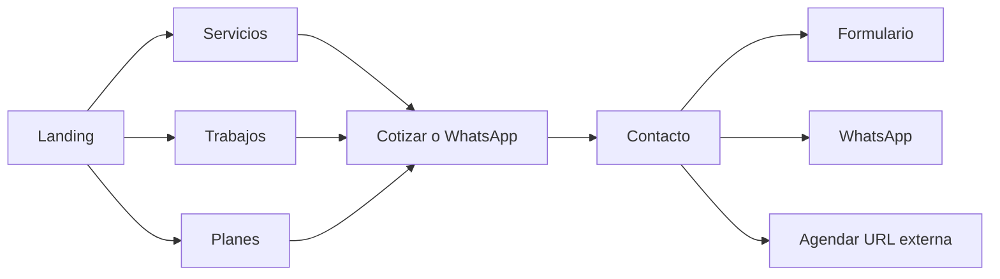

# Plan: sitio web VisualBoost

## Enfoque técnico

- **Stack**: [Astro](https://astro.build) 5 + **TypeScript** + **Tailwind CSS**. Astro entrega HTML estático con poco JavaScript, optimización de imágenes integrada y carga típica en el rango 1–2 s en conexiones normales (junto con imágenes bien optimizadas y hosting en CDN).
- **Despliegue**: Vercel o Netlify (HTTPS/SSL por defecto, CDN global). El build es estático (`output: 'static'`), sin servidor propio en v1.
- **Interactividad mínima**: “Islands” de Astro solo donde haga falta (p. ej. acordeón FAQ o filtros de galería) para no inflar el bundle.
- **Imágenes**: componente `Image` de Astro (formatos modernos, `width`/`height` para evitar CLS, `loading="lazy"` en galería).
- **Fuentes**: 1–2 familias vía `fontsource` o self-hosted (subconjunto) para no depender de bloqueos de terceros; **no** usar muchas variantes.

## Arquitectura de información y rutas

| Ruta | Contenido |
|------|-----------|
| `/` | Hero con propuesta de valor, CTAs, resumen de servicios, diferenciadores (48–72 h, planes, lenguaje simple, enfoque ventas), avance a planes y testimonios |
| `/quienes-somos` | Historia, enfoque estratégico vs. solo estética, para quién trabajan (emprendedores, pymes IG/marketplace, locales) |
| `/servicios` | Fotografía producto, lifestyle, reels/corto, edición para redes; beneficios orientados a ventas |
| `/trabajos` | Categorías (p. ej. *Producto*, *Lifestyle*, *Reels*, *Edición*) + galería filtrable; datos en archivos (ver más abajo) |
| `/planes` | Tabla o cards: Básico $120.000, Estándar $200.000, Premium $350.000 + qué incluye (sesiones/mes, banco de contenido, material listo) |
| `/faq` | Lista amplia de preguntas (plazos, revisiones, formatos de entrega, redes, cancelaciones…) |
| `/contacto` | Formulario, WhatsApp, bloque para **agendar** (URL a Calendly/Google Appointment u otro que tú configures), datos legales breves |

Navegación fija con **enlace “Saltar al contenido”** al inicio del `<main>` (WCAG).

## Diseño (sobrio, nicho ventas / contenido visual)

- Paleta **contenida**: fondo claro, texto alto contraste, un color de acento (p. ej. azul petróleo o verde bosque) para CTAs; evitar gradientes chillones.
- Tipografía legible en móvil (tamaños base ≥16px, interlineado cómodo).
- Espaciado generoso, jerarquía clara H1→H2→H3.
- Componentes reutilizables: `Button`, `Section`, `Card`, `PricingCard`, `PortfolioGrid`, `FAQ`.

## Contenido y datos editables

- **FAQ y textos largos**: Markdown u objetos TS en [`src/content/`](src/content/) (patrón Content Collections de Astro) para cambiar copy sin tocar maquetación.
- **Portfolio**: lista de ítems `{ category, title, image, alt }` en un archivo TypeScript o colección; imágenes en `public/` o `src/assets/`; la galería filtra por categoría en el cliente con estado mínimo.

## Accesibilidad (orientación WCAG 2.1 AA)

- Contraste texto/fondo verificado en acentos y botones.
- Formularios: `<label>` asociado, `aria-invalid` / mensajes de error.
- FAQ: `<details>`/`<summary>` o acordeón con teclado y roles ARIA si se usa componente custom.
- Todas las imágenes del portfolio con **texto alternativo descriptivo** (no solo “foto 1”).
- Focus visible en enlaces y botones (`:focus-visible`).

## Integraciones MVP (según tu elección)

- **Cotización / consulta**: formulario que envíe vía [Formspree](https://formspree.io), [Netlify Forms](https://docs.netlify.com/forms/setup/) o endpoint serverless (según hosting); incluir checkbox de aceptación de tratamiento de datos (base para RGPD si hay visitantes UE).
- **WhatsApp**: botón flotante o CTA con `https://wa.me/...` y mensaje prellenado opcional.
- **Agendar cita**: botón que abre la URL de Calendly (o similar); sin embed obligatorio en v1 para mantener ligereza.
- **Chat opcional**: documentar en README cómo pegar el script de Crisp/Tawk **sin** incluirlo por defecto (evita cookies/extra JS hasta que lo actives).

**Fuera de alcance v1** (acordado): portal de usuario, seguimiento de pedidos y chatbot propio. La mención de “SSL y RGPD” en la web se cubre con página/resumen de privacidad corto + HTTPS del hosting.

## Prueba social y confianza

- Bloque de **testimonios** (3 tarjetas con nombre/negocio genérico o placeholders hasta tener casos reales).
- Opcional: fila de “tipos de cliente” o logos en escala de grises (placeholders si no hay marca aún).

## Rendimiento y UX

- Priorizar **mobile-first** en Tailwind (`sm:`, `md:`, `lg:`).
- Evitar carruseles pesados; galería tipo grid con lightbox opcional ligero o enlaces a sección ampliada.
- Meta tags Open Graph y título/description por página para compartir en WhatsApp/IG.

## Estructura de carpetas sugerida

```
/
├── public/                 # favicon, og-image, imágenes estáticas si aplica
├── src/
│   ├── components/
│   ├── layouts/Layout.astro
│   ├── pages/              # rutas anteriores
│   ├── content/            # faq, portfolio data
│   └── styles/global.css
├── astro.config.mjs
├── tailwind.config.mjs
└── tsconfig.json
```

## Diagrama de flujo del usuario



## Entregables

- Repositorio en [VisualBoost](file:///Users/macbook/Documents/DEV/VisualBoost) con sitio funcional en dev y build estático listo para desplegar.
- Textos en **español** alineados a tu propuesta de valor y diferenciadores.
- Instrucciones breves en README: variables de entorno si el formulario lo requiere, URL de WhatsApp, URL de agenda, activación opcional del chat.
